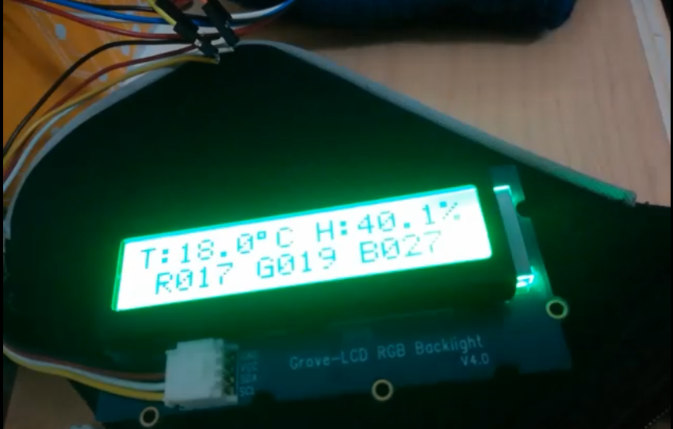

## Description

Project developed with Raspberry Pi in programming language C, C++ with I2C communication protocol for sensor control and data collection projected on LCD screen.

Devices used:

**To capture parameters:**

* Temperature and Humidity Sensors (Si7021 and AM2320)
* Color sensor (TCS34725)

**To display information:**

* 16x2 RGB backlit LCD display (JHD1313/PCA9633)
*RGB Leds

For more details, go to the specific project folder: images/readme.md

## Authors

**Alejandro Martinez**

* [LinkedIn](https://www.linkedin.com/in/diego-alejandro-martinez-espinosa-571086134)

**Francisco Lupi**

* [LinkedIn](https://www.linkedin.com/in/francisco-martin-lupi)

## Screenshots 

 
 

## Installation

This project requires to be installed on a Raspberry Pi 3 and to use the aforementioned sensors with their respective connections.

## Feedback

If you have any feedback, please reach out to us at dreamstime@outlook.es
